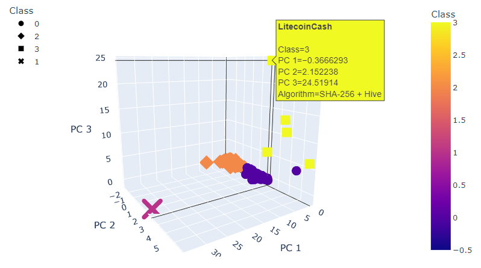

# Cryptocurrencies
Use unsupervised machine learning techniques to analyze cryptocurrency data.

## Overview of the analysis
Your client, a prominent investment bank, is interested in offering a new cryptocurrency investment portfolio for its customers. The company, however, is lost in the vast universe of cryptocurrencies. So, they’ve asked you to create a report that includes what cryptocurrencies are on the trading market and how they could be grouped to create a classification system for this new investment.

As the data will be working with is not ideal, so it will need to be processed to fit the machine learning models. Since there is no known output for what the client is looking for, you decided to use unsupervised learning.

To group the cryptocurrencies, you decided on a clustering algorithm. You wll use data visualizations to share you findings with the client.

## Data Source:
The [cryto data](./Resources/crypto_data.csv) was retrieved from [CrytoCompare](https://min-api.cryptocompare.com/data/all/coinlist).

## Deliverables:
[Deliverable 1](./crypto_clustering.ipynb): Preprocessing the Data for PCA

[Deliverable 2](./crypto_clustering.ipynb): Reducing Data Dimensions Using PCA

[Deliverable 3](./crypto_clustering.ipynb): Clustering Cryptocurrencies Using K-means

[Deliverable 4](./crypto_clustering.ipynb): Visualizing Cryptocurrencies Results

Deliverable 5: A Written Report on the Crytocurrencies Analysis (this file)

## Results:
* We preprocess the data by filtering those useless features, use `get_dummies()` to encode the features, and use `fit_transform()` to standardize the features.

* We apply the **Principal Component Analysis (PCA)** algorithm to reduce the dimensions of the features to three principal components.

* We create an elbow curve using `hvplot` to find the best value for K from the dataset. From the elbow curve below, it indicates point 4 can be the elbow. Thus we run K-Means model with k = 4 (i.e. 4 clusters), and make the predictions.

* Visualizating Cryptocurrencies Results:
1) 3D-Scatter:
    * Use the Plotly Express `scatter_3d()` to visualize the distinct groups that correspond to the three principal components.

2) 2D-Scatter:
    * Use `hvplot` to visualize the clusters with two scaled features: TotalCoinsMined and TotalCoinSupply.

## Summary:
* Based on the elbow curve, it suggested that we can use 4 clusters in the K-Means model (i.e. k = 4).
* Based on the data provided, there are **532** tradable cryptocurrencies on the trading market.
* These cryptocurrencies can be grouped into 4 clusters based on the given features.
